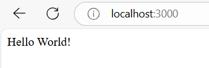
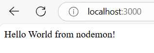
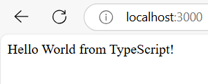
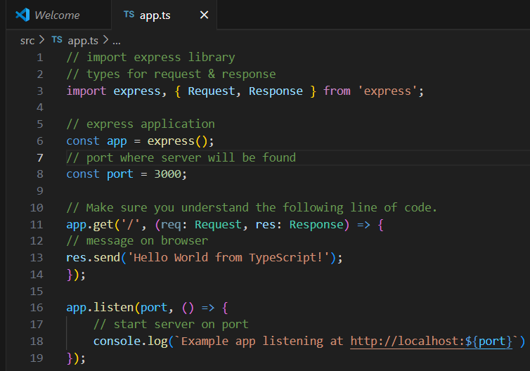

# Activity-0

- Author: Ashley Barron
- Date: 1-16-25
- Class: CST-391
- Title: Activity 0

 

## Screenshots
### Screenshot 1
#### node -v

- This screenshot shows the terminal window where I typed in “node -v”. After clicking enter, it displays the version that was validated. 

### Screenshot 2
#### npm -v

- This screenshot shows the terminal window where I typed in “npm -v”. After clicking enter, it displays the version number that was validated. 

### Screeenshot 3
#### NodeJS Hello World

- This screenshot shows the terminal displaying the message “Hello World!”. It shows the message from the app.js file in the hello folder. 

### Screenshot 4
#### Browse Hello World

- This screenshot shows the web browser after navigating to “localhost: 3000”. It displays the message from the app.js file in the hello folder: “Hello World!”, the same as the last screenshot, only that this is shown in the web browser. 

### Screenshot 5
#### Node Monitor String Change

- This screenshot shows the web browser after navigating to “localhost: 3000”. It displays the message from the app.js file in the hello ex folder: “Hello World from nodemon!”. 

### Screenshot 6
#### Typescript Hello World

- This section shows the web browser after navigating to “localhost:3000”. It displays the message from the app.ts file in the src folder: “Hello World from TypeScript!”

### Screenshot 7
#### Application Running

- This screenshot shows the app.ts file’s code. It shows the import express library along with its types for the request and response. It also shows an express app and port number of where the server will be found. The last section also shows the messages on the browser and the server port. 

