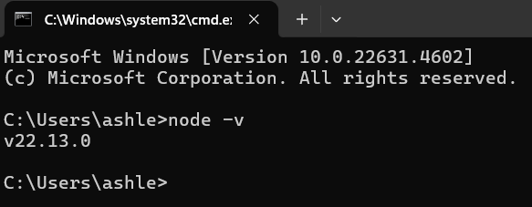

# Activity-0

- Author: Ashley Barron
- Date: 1-16-25
- Class: CST-391
- Title: Activity 0

 

## Screenshots
### Screenshot 1
#### node -v

- This screenshot shows the terminal window where I typed in “node -v”. After clicking enter, it displays the version that was validated. 

### Screenshot 2
#### npm -v

- This screenshot shows the terminal window where I typed in “npm -v”. After clicking enter, it displays the version number that was validated. 

### Screeenshot 3
#### NodeJS Hello World

- This screenshot shows the terminal displaying the message “Hello World!”. It shows the message from the app.js file in the hello folder. 

