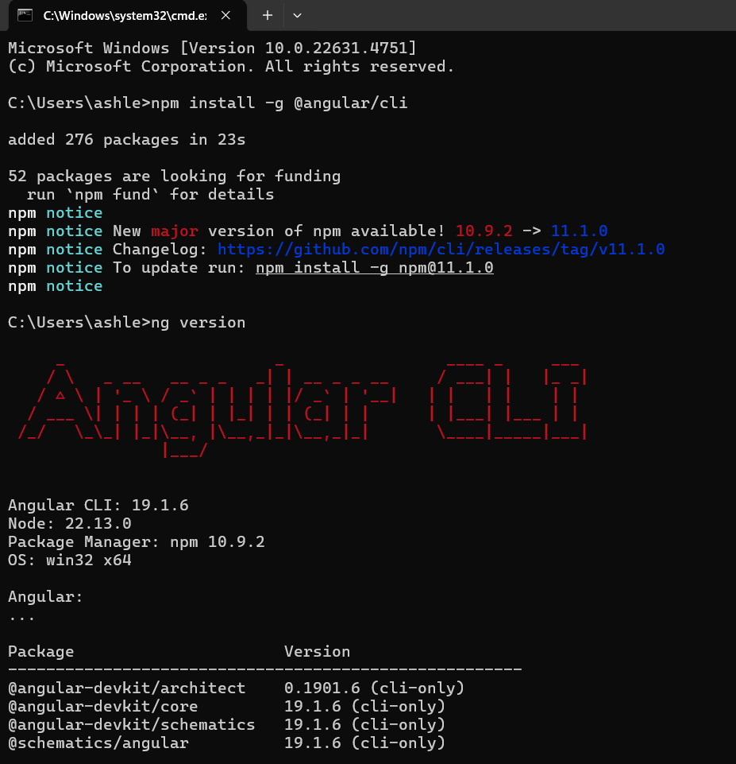
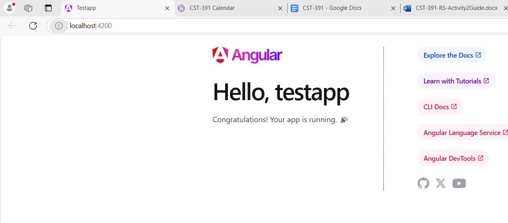
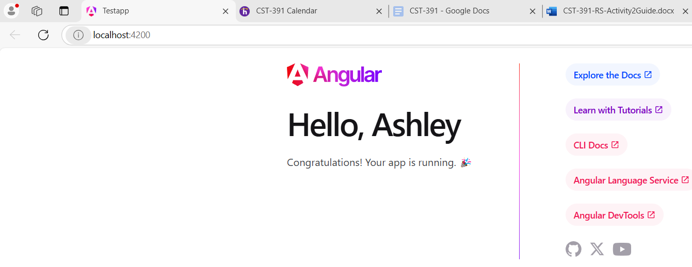
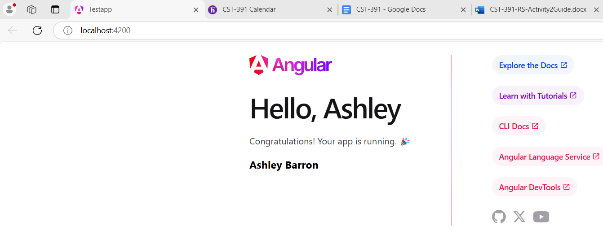

# Activity 2

# Screenshots

## Screenshot 1

- This is a screenshot of the command promt when insering two commands and installing Angular CLI. 

## Screnshot 2

- This is a screenshot of my broswer showing the application running. 

## Screenshot 3

- This is a screenshot of my browser showing the application running after changine the title variable from "testapp" to my name, "Ashley". 

## Screenshot 4

- This is a screenshot of my browser showing the application running after adding a message variable in the app.components.ts and a header in the app.component.html. It says my full name, "Ashley Barron".

## Research Questions
- Questions
    - a. Inspect the default test project structure created in the Activity. Describe the purpose for each of the folders of the following in the project structure: node_modules, src, src/app, src/assets, and src/environments. Also, describe the purpose for each of the following files in the project: angular.json, package.json, and tsconfig.json.

    - b. Inspect the page source for the default page displayed when running the test project. Explain how the resultant page was generated by Angular by providing a brief overview and purpose for each of the following files: main.ts, app.component.css, app.component.html, app.component.ts, and app.module.ts

- Answers
    - **a.** 
    
    *node_modules*
    - The node_modules folder holds all of the dependency packages that are essential when running the application. This is where installed libraries using npm are held. 

    *src*
    - The src folder contains all of the source code for the application. It's where the main app files are held such as styles, templates, and components. 

    *src/app*
    - The src/app folder contains the html and ts pages that take care of constructing the localhost such as uncluding its messages and titles. 

    *src/assets*
    - The src/assets fodler is where it keeps all of the images or icons for the website. 

    *src/environments*
    - The src/environments folder holds environment-specific settings, such as configrations for development. 

    - b. **lh

