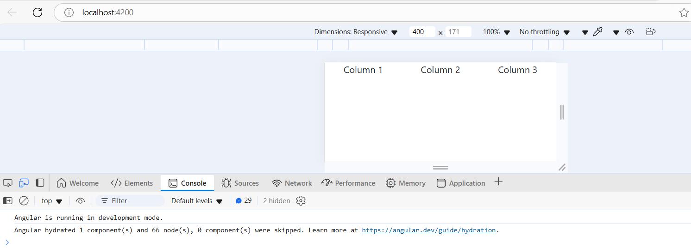
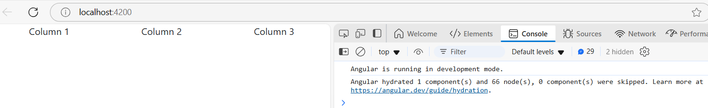
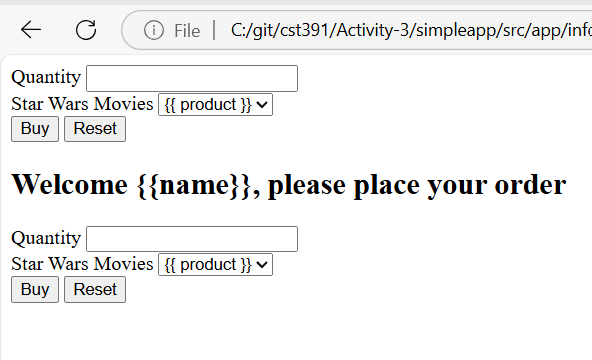
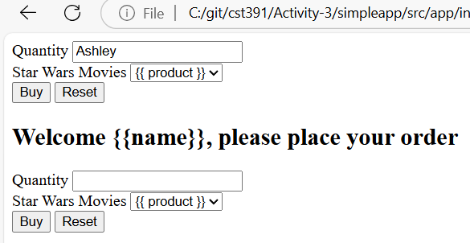
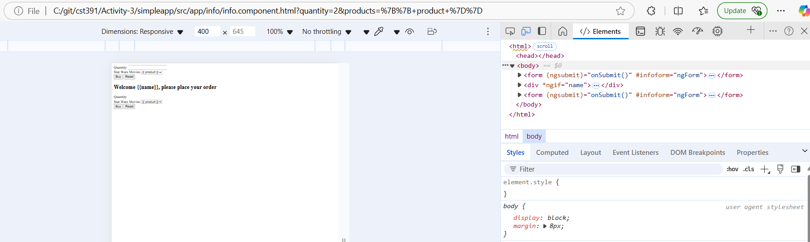
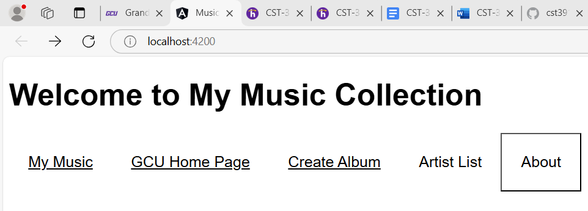
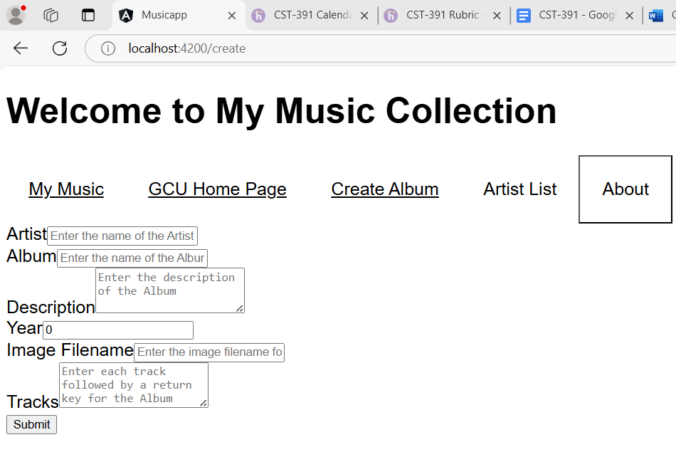
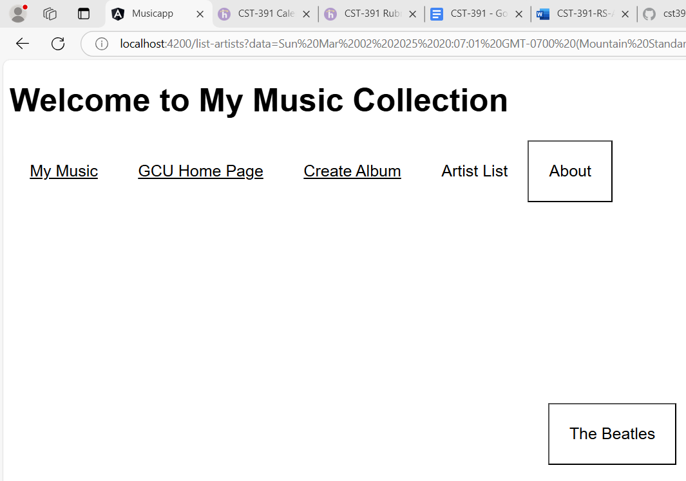
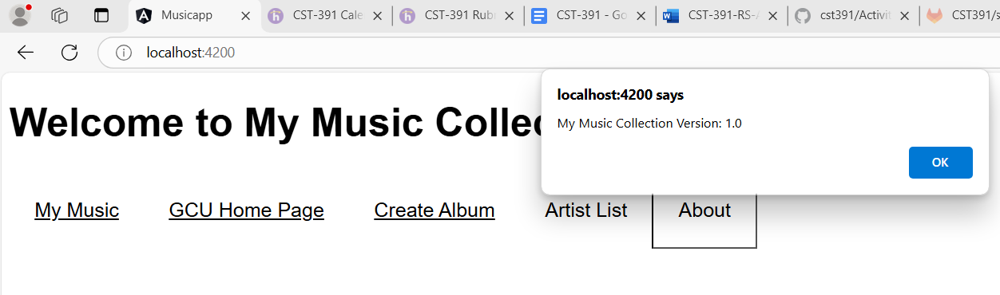

# Activity 3
## Part1
## Screenshots

- This is a screenshot of my the begginig/home page in the way I edited it. I deleted the code in it and added a grid from the bootstrap. The devtools show what it would look like in a laptop/computer

- This is a screenshot of the devtools showing what it would look like in a different device, which is a phone in this case. 

- This is a screenshot of the html section before entering any information. Although, in this case it would be your name. 

- This is a screenshot where it would show after I entered my name and in its place would show a message welcome in me such as "Welcome Ashley". 

- This is a screenshot of clicking on the "buy" button after checking the devtools. In the "Elements" tab, it shows the "onSubmit()" method and the html section of the page. 

## Part2
## Screenshots

- This is a screenshot of the initial aplication page.

- This is a screenshot of GCU's Home page. When clicking on this button, it takes the user to GCU's acutal home page, so this isn't a page that we created.

- This is a screenshot of the create album page. In this page, the user inserts the information of an artist, their album, description, year, etc.

- This is a screenshot of the albums list page. This list page shows a list of albums titles that are already stored in the application and/or the new ones that the user might add.

- This is a screenshot of the about box. Unlike the rest of the screenshots, this isn't a page, it's a box/message that appears at the top that says "My Music Collection Version: 1.0".

## Research Questions 
### Part 1
1. Describe @Input decorator used in info.component.t
2. Describe value used in info.component.html
3. Describe ngModel also used in info.component.html

## Research Answers
1. The @Input() decprator in angular is used to pass data from a parent component to a child component. In info.component.ts, the @input() is applied to the "name" property, allowing the shopcomponent to send the "answer" value to InfoComponent. It allows the InfoComponent to display the name its template. 
2. The value binding in Angular is used to bind the values of a property in the component class to an element's attribute in the template. In info.component.html, the value is used to bind each movie name in the "products" array to the "option" element in the select dropdown. 
3. ngmodel is Angular's two-way data binding syntax that synchronizes data between the component and template. It links an input field to a component property, ensuring that when the user updates the input, the component property is automatically updated. 

## Research Questions
### Part 2
#### Research

1. Add complete comments to music-service.service.ts. Include this commented code in a Microsoft Word document or a text document. Make sure your submission reads like a code file.

## Research Answer
[Part 2 Question](questions2.txt)
