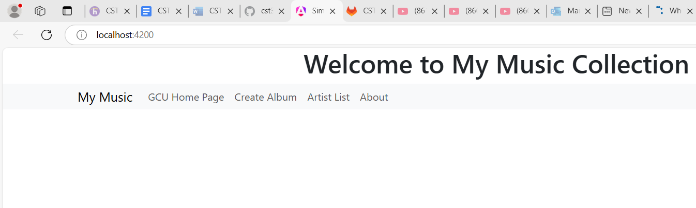
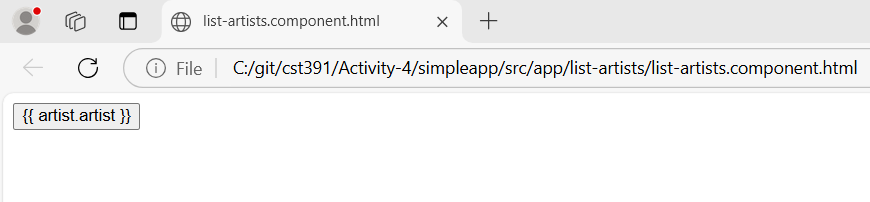
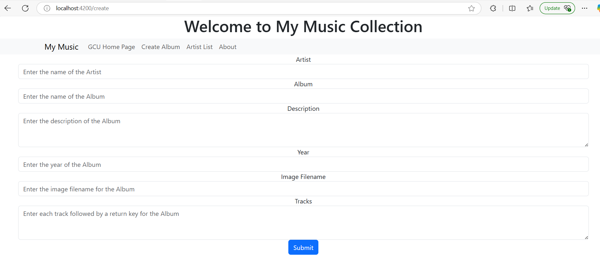
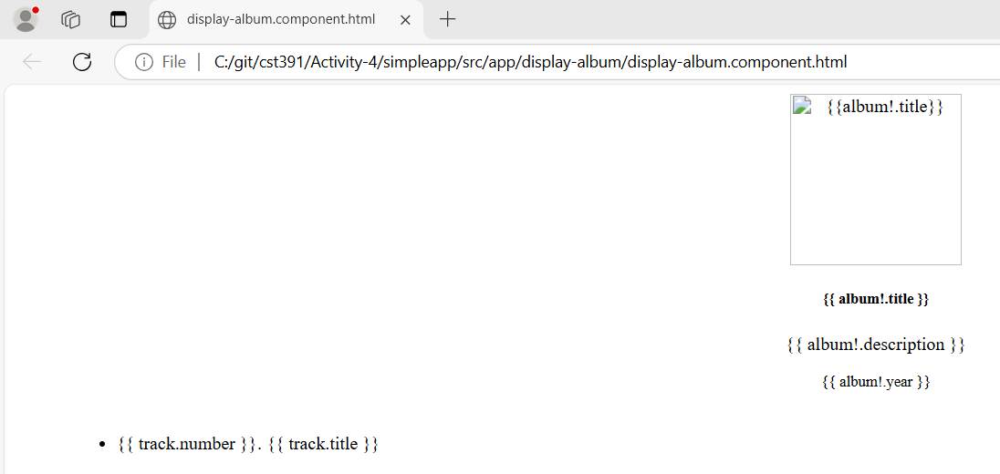
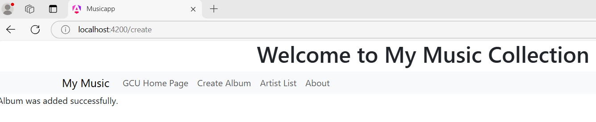
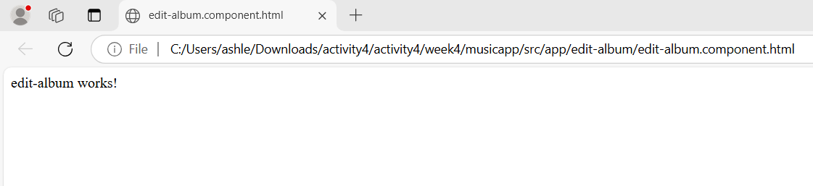
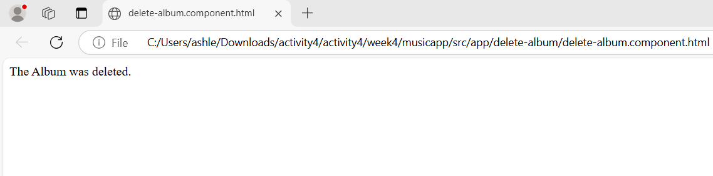

# Activity 4
- Author: Ashley Barron
- Date: 3-4-25
- Class: CST-391
- Title: Activity 4

## Screenshots

- This is a screenshot of the Main Screen Application page, where it shows that the localhost is "localhost:4200", the middle shows a message welcoming the user, "Welcome to My My Music Collection", and the navbar with different sections.

- This is a screenshot of an html section/page of the Artist List screen where in its place, it would show a list of artists. 

- This is a screensshot of an htmla Albums page where it asks the user to enter the name of the artist, album, description, year, image filename, and tracks. 

- This is a screenshot of an html Albums Display page where it shows a picture of the album, the title, description, album year, tracn number, and track title. 

- This is a screenshot of the add albums section/page. After the user enters their information, it will redirect them to this page and display a message that says "Album was added successfully".

- This is a screenshot of an html section/page of what the website would look like if the user decides to edit their album. It would display a message saying "edit-album works".

- This is a screenshot of an html section of what the website would look like if the user decides to delete their album. It would display a message saying "The Album Was Deleted".

## Rsearch Questions
1. Research how an Angular application maintains a logged in state. How does it communicate this state to the server?

## Research Answers
1. The most popular method for keeping an Angular application signed in is to use local storage, cookies, or JWT (JSON Web Tokens) in combination with session management. Firstly, when a user logs in, the Angular application uses an HTTP Post request to communicate the login information, such as the password and username to the backend (server). The server creates a JWT or session token and sends it back to back to the Angular client if the credentials are valid. Once the Angular app receives the token, it stores it in either the Local Storage, Session Storage, or cookies. The Local Storage is an easy-to-use technique that keeps tokens safe even when the user reloads the website. The Session Storage keeps the token for the duration of the session, yet it's comparable to local storage. Once the browser has been closed, it is cleared. When it comes to cookies, the token can be stored in the cookies with a suitable expiration date. The Angular App uses an AuthService to verify whether a token is valid in sessionStorage, localStorage, or cookies. The user's data is loaded and they're authenticated if they're located. Additionally, the service handles token expiration; if the token expires, it logs the user out. Angular uses the authorization nheader, formatted as user Authorization: Bearer "token". To confirm the user's identity and verify if the token is still valid, the backend validates the token for every request. The token is deleted from cookies, localStorage, or sessionStorage after the user logs out.  The backend can invalidate a token that's stored in cookies by deleting it from the server. 