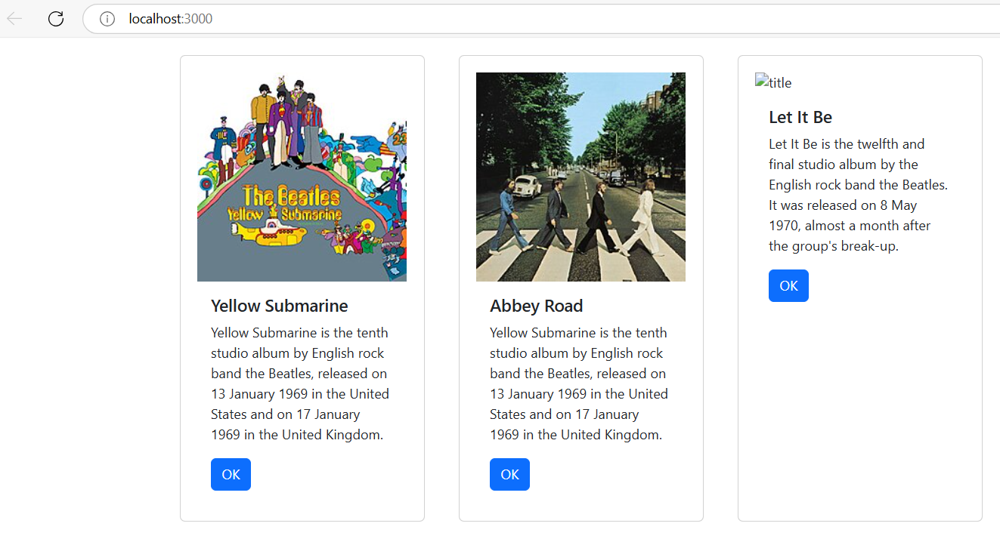
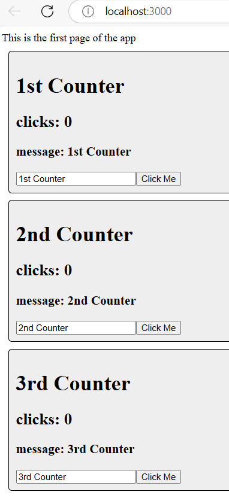

# Activity 5
- Author: Ashley Barron
- Date: 3-18-25
- Class: CST-391
- Title: Activity 5

## Introduction 
- *Explain

# Activity Summary Page
# Screenshots

- This is a screemshot of the Music Application showing three pictures of three albums, their title, and a paragraph about them with the ok button underneath them. 

- *This is a screenshot of the state changer application showing three sections that show the number of counters, its message, clicks, and a "click me" button where the user clicks on it, and it increments its clicks.

#### ***zip up both projects!!!!**

# One-Paragraph Summary
- In the first section of the activity, I created a list if album cards with React Components. Each album section shows an album image, description, "OK" button, and title. The list of albums is now managed and shown to the user by using state. In order to maintain the application's reusability and organization, I also used custom components. In this session, new terms such as "state", "props", and "components" were used to construct the app's structure and transfer data across its numerous components. 

# Conclusion

# Research questions???*****
