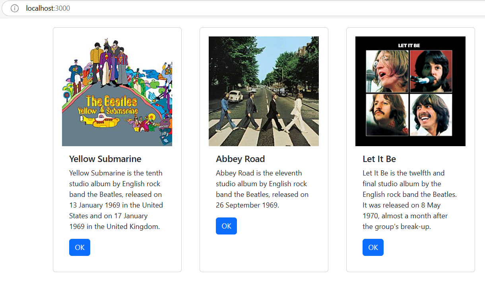

# Activity 5
- Author: Ashley Barron
- Date: 3-18-25
- Class: CST-391
- Title: Activity 5

## Introduction 
- In this activity, we improved the React Music Application by applying important concepts such as state, props, and the map() function to constantly manage and demonstrate album data. Using reusable components, we structured the application to make it more sustainable and more flexible. We also updated the visual design by using Bootstrap's grid system and CSS to generate a more adaptable and organized layout. These improvements made the app more user-friendly and interactive along with improving its function.

# Activity Summary Page
# Screenshots

- This is a screemshot of the Music Application showing three pictures of their albums, their title, and a paragraph about them with the ok button underneath them. 

- This is a screenshot of the state changer application showing three sections that show the number of counters, its message, clicks, and a "click me" button where the user clicks on it, and it increments its clicks.

- This is a screenshot of the Music Application showing three pictures of theit albums, title, a paragraph about them, and an "ok" button. Though, for the third screenshot, I added a picture from wikipedia to show an image in its place. In the first screenshot, it wasn't showing the original image so I looked up another one. 

#### ***zip up both projects!!!!**

# One-Paragraph Summary
- In the first section of the activity, I created a list if album cards with React Components. Each album section shows an album image, description, "OK" button, and title. The list of albums is now managed and shown to the user by using state. In order to maintain the application's reusability and organization, I also used custom components. In this session, new terms such as "state", "props", and "components" were used to construct the app's structure and transfer data across its numerous components. 

# Second One-paragraph Summary
- In the last section of the activity, we worked with the map() function, which iterates over an array and produces a changed list of components, we upgraded the React application by instantly providing a list of album cards. We added state, which allows components to use the useState hook to directly store and modify data. We also used props to transfer album details from the parent App component to the child Card component in order to present reusable and modular user interface elements. To enhance the application's visual appeal, we used CSS styling and bootstrap's grid system to display album cards in an organized layout. The application is now more dynamic, organuzed, and visually appealing thanks to these enhancements. 

# Conclusion
- *Throughout this activity we developed a more dynamic and modular music app by gaining hands-on experience with major React concepts such as state management, props, and the map() method/function. greatly boosted the functionality of our software by including these features and organizing it with reusable components. We also improved the interface by using CSS and Bootstrap, which refined the layout and made the app more aesthetically pleasing and responsive. Aside from improving the user experience, these enhancements give the basis for future work, where we plan on incorporating REST servcies and external data sources to increase the app's scalability and functionality. 

# Research questions???*****
