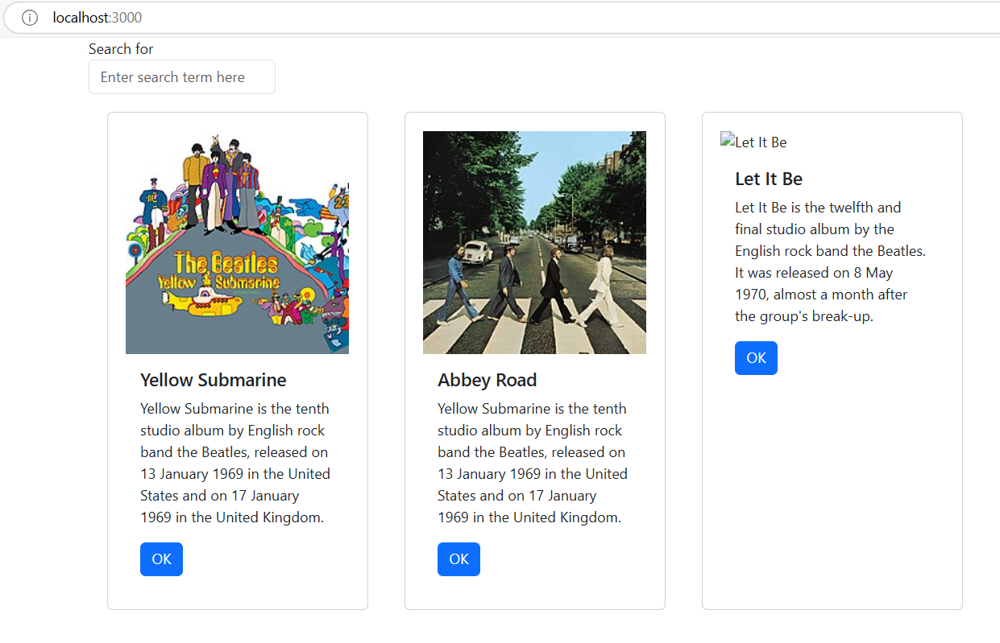
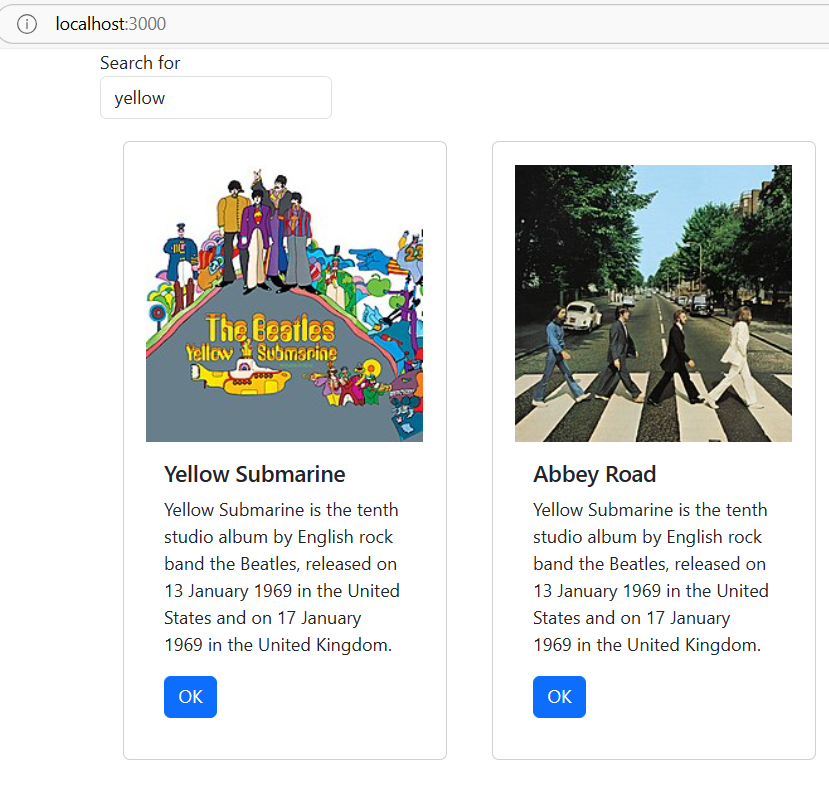
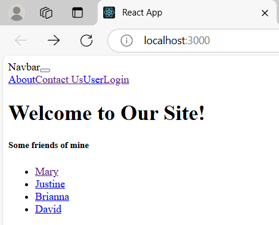
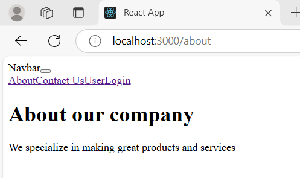
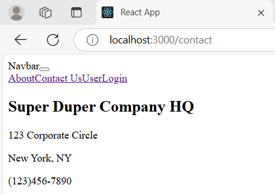
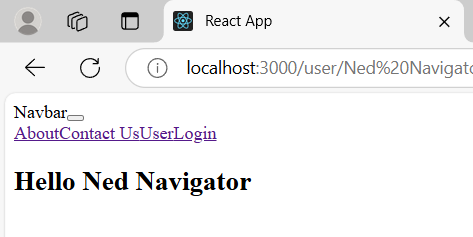
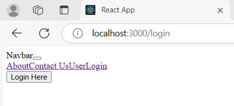
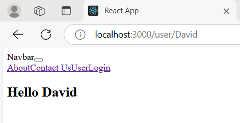
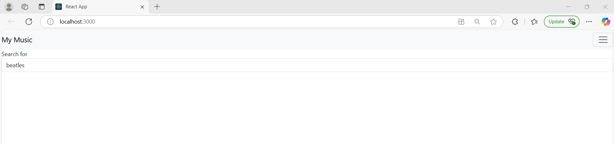

# Activity 6
- Author: Ashley Barron
- Date: 4-3-25
- Class: CST-391
- Title: Activity 6

## Introduction
- **In this activity...

# Part 1
## Screenshots

- This is a screenshot of the program running and showing the main page woth three examples of albums and their information

- This is a screenshot of the music site if the user types in something in the search bar. For my example, I typed "yellow", and it shows the albums that are related to "yellow".

# Part 2
## Screeshots

- This is a screenshot of the router program running when first starting it. It shows the application welcoming the user to the site with a navbar showing the pages: about, Contact Us, user, and login. It also shows a list of friends at the bottom. 

- This is a screenshot of the About page talking about the application's company. 

- This is a screenshot of the Contact page showing the site/company's contact information. 

- This is a screenshot of the User page greeting the user. 

- This is a screenshot of the login page with a "Login Here" button. Once the user logs in, they will be redirected to the Main Page. 

- This is a screenshot of the "David" page. The main page shows a list of different names/friends such as Mary, Justine, Brianna, and David. For this example, I selected the David page and if I were to select any of the other pages, it would be similar to this page, though it would instead say another name. 

# Part 3 
## Screenshots

- This is a screenshot of the music application after updating it. Where it shows the search bar, side bar, and title. 

# One-Paragraph Summary Part 1
- This section provided new features such as role-based access control, session management, and login authentication in order to enhance security. While authentication verifies a suser's identity, session management tracks users as they navigate through the website. Role-based access control or RBAC, make sure that users can only access features that match their jobs such as administrator or customer. 

# One-Paragraph Summary Part 2
- For part Mini App #2, we swithced to React 18 and used ReactDOM. Thee new rendering system, which improves effectiveness by drawing UI updates in the background, is enabled by using createRoot(). We additionally updated to React Router v6, which makes route handling easier by eliminating the requirement for render props and component by using the element prop in the Route component. In order to handle redirects in a more declarative way, this version also included the Navigate component, which replaces the redirect component. These updates ensure that the application functions smoothly with the latest React features and improve routing efficiency. Furhtermore, these upgrades allow a better user experiene, especially in complex applications where routing and efficiency are essential components. 

# One-Paragraph Summary Part 3
- For part 4: Navigating Route, we enhanced the operation of the music app by adding new features to it. We used React Router to move between pages such as viewing all albums, adding new ones, and displaying data for a single one. To show and arrange album data we used components such as OneAlbum and AlbumList. The application now uses React hooks such as useState and useEffect to dynamically manage and change the app's state and Axios for API calls to load data from a server. 

# *Research Questions?

# *Answers?

# Conclusion
***....