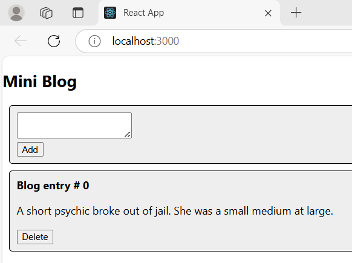
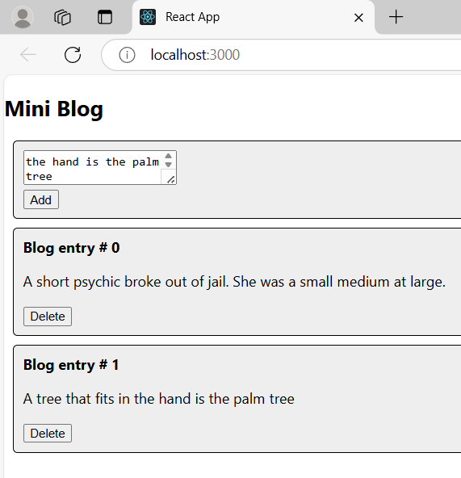
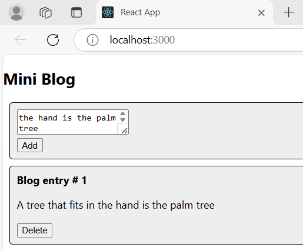
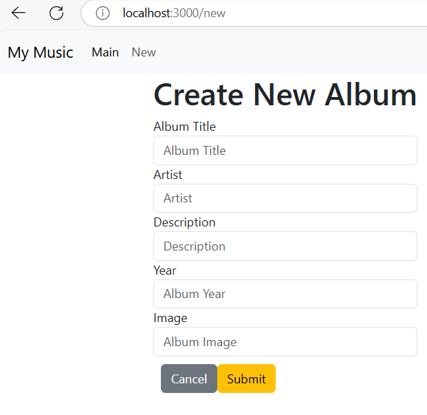
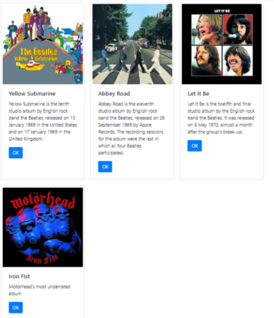

# Activity 7
- Author: Ashley Barron
- Date: 4-11-25
- Class: CST-391
- Title: Activity 7

## Introduction
- Through a variety of tasks, we will investigate the creation of dynamic React applications in this activity.  Building applications that let users add, update, and remove items—like blog entries and albums—will be the primary focus.  We'll discover how to handle events, manage state, build functional components, and transfer data between components via props.  We will learn more about the fundamentals of React and how to create dynamic user interfaces by developing these interactive elements.

## Screenshots Part 1

- This is a screenshot of the Mini blog page once it starts running. It shows the available blogs and gives the reader options to add and delete. 

- This is a screenshot of the mini blog if the user decides to add a blog entry. The user adds whatever they want, click the "Add" button, then at the bottom it adds the text with the new entry number. In this case, the entry number is 1 since the first was 0. 

- This is a screenshot of the mini blog if the user decides to delete a blog entry. The user decides the entry they want to delete, click the "Delete" button, then that entry will be deleted. For this example I decided to delete entry #0, so it now only shows blog entry #1. 

## Summary
- This section taught us how to create a dynamic React application that lets users add and remove blog entries.  We developed a new React application and organized the user interface using functional components like Post.js and AddPost.js.  We looked at using array methods and the spread syntax to update a list of posts in useState.  In order to relate the form input to the state and update it with each change, controlled components were developed.  Additionally, we used event handlers and unique keys to implement remove functionality.  This mini-app showed how to alter the user interface (UI) in response to user interaction and dynamically render components.

## Screenshots Part 2

- This is a screenshot of the "create new album" page, where it asks the user to insert their album info. 

## Summary
- Here, we used React to develop a form that lets users add new albums.  We designed the layout using Bootstrap and converted the HTML to JSX by closing all tags and substituting className for class.  The form employs controlled components, which means that onChange handlers are used to track changes and useState is used to link each input to a piece of state.  After the form is submitted, useNavigate is used to reroute the user and send the data to the parent component via a prop.  As a result, the app is more dynamic and the album list may be updated by user input.

## Screenshots Part 3

- This screenshot is an example of what the web application looks like after adding a new album. It shows the available albums and underneath it shows the added albums along with their information. 

## Summary
- In this section, we learned how to refactor the NewAlbum component into EditAlbum to handle both creating and editing albums. We modified the form to check if an album is present in props to switch between new and edit modes. The form submission distinguishes between POST for new albums and PUT for updates, while preserving album IDs. We passed data and callback functions through components like SearchAlbum, AlbumList, and Card, and ensured proper navigation with URIs. Challenges remain, such as adding track editing, feedback for updates, and cancel button functionality.

# Conclusion
- Through the creation of dynamic components for adding, modifying, and removing blog articles and albums, this exercise improved our understanding of React.  To make the application interactive and responsive, we used fundamental ideas like state management, event handlers, and controlled components.  In order to manage both creation and editing functionalities, we also learnt how to refactor and alter components.  Even if there are still issues to be resolved, including improving the user interface and including additional functionality, this exercise gave me important knowledge about how to use React to create more complex web apps.